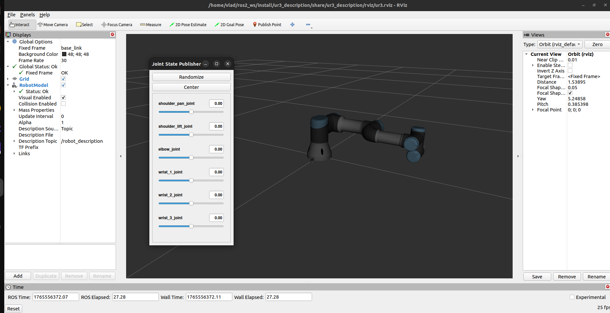
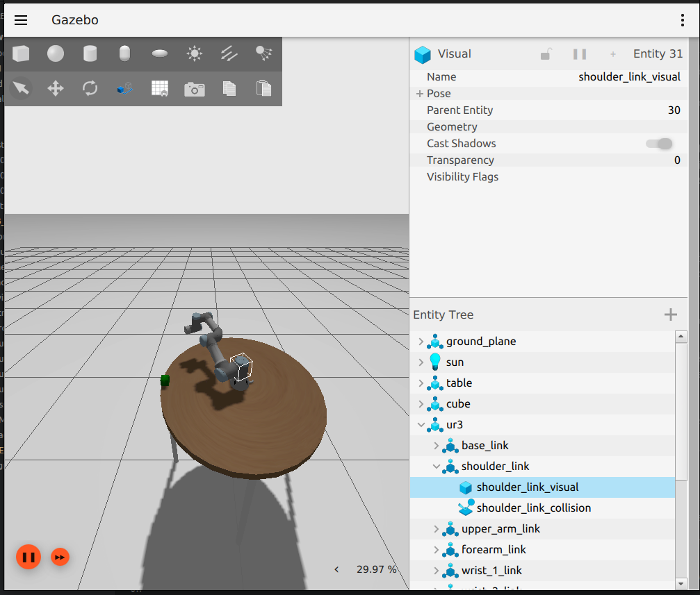

# Assignment 2: UR3 Manipulation & Training

## Package Overview
This package contains the UR3 robot description, controllers, simulation environment, and training setup for COMP9069 Robotics & Autonomous Systems Assignment 2.

## Task 1: UR3 Description [10%]
**Status**: Complete

Implementation Details:
- Created CMake package `ur3_description` using `ros2 pkg create --build-type ament_cmake ur3_description`
- Copied Assignment2.zip contents into package directory
- Added install directives to CMakeLists.txt
- Fixed URDF configuration:
  - Corrected launch file `ur3_rviz.launch.py` (lines 10-12) to use `ur3.urdf.xacro` instead of `ur3_description.urdf.xacro` - the latter file didn't exist, causing robot not to appear in RViz with "Frame [base_link] does not exist" error
  - Fixed robot name attribute in `ur3.urdf.xacro` (line 2) from `$(arg name)` to hardcoded `ur3` - xacro arguments must be defined before use, otherwise causes "Undefined substitution argument name" error
- Added ros2_control configuration in `ur3.ros2_control.xacro`:
  - Defined hardware interface with gz_ros2_control/GazeboSimSystem plugin (line 8)
  - Added all 6 joints with command and state interfaces (lines 11-63)
  - Configured joint limits: ±2π for all joints except elbow joint (±π) in `ur3_controllers.yaml`
- Created Gazebo simulation environment in `ur3_gazebo.launch.py`:
  - Launch file with robot_state_publisher, gz_server, and ros_gz_bridge
  - Spawned table model at coordinates (0, 0, 0) using ros_gz_sim create node (lines 62-72)
  - Spawned cube model at coordinates (0, 0.5, 1) using ros_gz_sim create node (lines 79-89)
  - Spawned UR3 robot model at coordinates (0, 0, 1) using ros_gz_sim create node (lines 96-106)
  - Activated joint_state_broadcaster (line 115) and forward_position_controller (line 130) via spawner nodes
- Verified controller functionality through terminal commands

RViz Visualization:
The image below shows the UR3 robot visualization in RViz with the joint state publisher GUI. The interface allows for interactive manipulation of the robot's joints to verify kinematic behavior.


Gazebo Simulation:
The image below shows the UR3 robot in the Gazebo simulation environment along with the table and cube objects positioned according to the assignment requirements.


System Architecture Diagram:
```
        +-----------------+
        |   RViz/GUI      |
        +--------+--------+
                 |
        +--------v--------+
        | robot_state_pub |
        +--------+--------+
                 |
        +--------v--------+     +--------------------+
        |   URDF Model    |<----+ ros2_control Plugin |
        +--------+--------+     +---------+----------+
                 |                          |
        +--------v--------+     +---------v----------+
        |   Gazebo Sim    |<----+ Controller Manager |
        +-----------------+     +--------------------+
```

Component Positions in Gazebo:
```
Z-axis (height)
^
|    Robot (0,0,1)
|     o
|    /|\
|   / | \
|  o  o  o
|
|  Cube (0,0.5,1)
|    []
|
|  Table (0,0,0)
|  _________
|____________________> Y-axis
(0,0,0)    (0,0.5,0)
```

## Build Instructions

```bash
cd ~/ros2_ws
source /opt/ros/humble/setup.bash
colcon build --packages-select ur3_description
source install/setup.bash
```

## Usage

### View Robot in RViz
```bash
ros2 launch ur3_description ur3_rviz.launch.py
```

### Launch Gazebo Simulation
```bash
ros2 launch ur3_description ur3_gazebo.launch.py
```

### Control Robot Joints (via terminal)
```bash
# Move to specific joint positions
ros2 topic pub --once /forward_position_controller/commands std_msgs/msg/Float64MultiArray "{data: [0.5, -0.5, 0.3, 0.0, 0.0, 0.0]}"

# Return to zero position
ros2 topic pub --once /forward_position_controller/commands std_msgs/msg/Float64MultiArray "{data: [0.0, 0.0, 0.0, 0.0, 0.0, 0.0]}"

# Bend elbow
ros2 topic pub --once /forward_position_controller/commands std_msgs/msg/Float64MultiArray "{data: [0.0, -1.0, 1.5, 0.0, 0.0, 0.0]}"
```

## Package Structure

```
ur3_description/
├── config/              # Controller and bridge configurations
├── launch/              # Launch files for RViz and Gazebo
├── meshes/              # Visual and collision meshes
│   ├── visual/
│   └── collision/
├── models/              # Gazebo models (table, cube)
├── rviz/                # RViz configuration
├── urdf/                # Robot URDF/xacro files
├── CMakeLists.txt
├── package.xml
└── README.md
```

## Dependencies

- ROS 2 Humble
- Gazebo
- ros2_control
- ros_gz (ROS-Gazebo bridge)
- joint_state_publisher_gui
- robot_state_publisher

## Notes

### Task 1 Bug Fix
Fixed issue where robot was not visible in RViz:
- Changed launch file to use `ur3.urdf.xacro` instead of `ur3_description.urdf.xacro`
- Fixed robot name attribute in URDF from `$(arg name)` to `ur3` (resolved xacro argument ordering issue)

### Known Issues
For information about known issues with the UR3 training package (Task 2), please see the separate README.md in the ur3_training package or the ASSIGNMENT2_SUMMARY_REPORT.md file.

## Author
Vlad - COMP9069 MSc AI